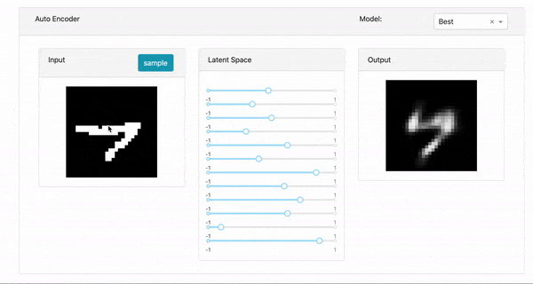

# visTorch

visTorch is a simple tool for interactive visualization of latent space of an Autoencoder. It's built using [Plotly's Dash framework](https://plot.ly/products/dash/) and has been tested with Pytorch.

## Installation

```bash
pip install -r requirements.txt
python setup.py install
```

## Usage

```python
from visTorch import visboard
...
# your code
...
vis_board = visboard()
vis_board.add_ae(model,
                dataset,
                latent_options={'n': model.latent_size, 'min': -1, 'max': 1, 'step': 0.05},
                model_paths={'Best': ae_path})
vis_board.run_server('127.0.0.1','8080')
```

Refer to ```.\example``` for more details

## Demo


